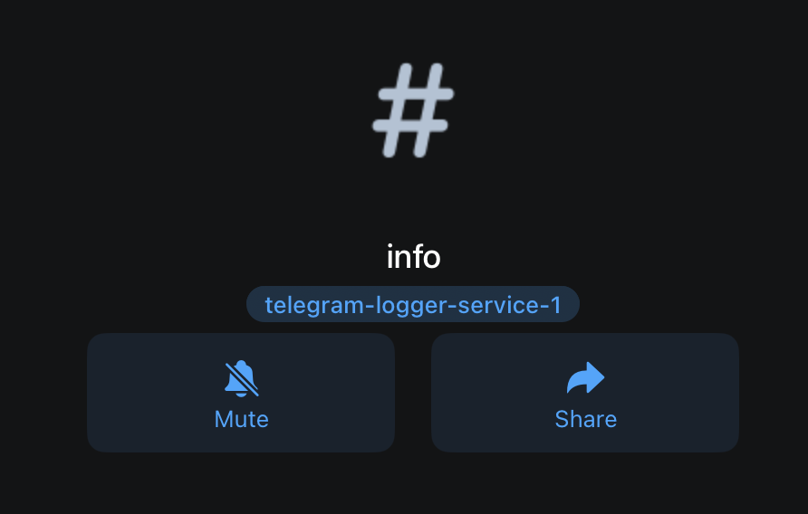

<h1 align="center">Telegram Error Logger</h1>

<div align="center">

Monitor server errors in real-time via Telegram. [Telegram Bot API](https://core.telegram.org/bots/api).


[](https://www.npmjs.com/package/telegram-error-logger)

</div>

## 📦 Install

```sh
npm i telegram-error-logger
```
<br/>

[prerequisites setup 🔴](#prerequisites)

```js
import {Logger} from 'telegram-error-logger';
// First initialise the logger with your bot token that you create from bot father

// Add the channels you want your error message to be sent to -> e.g send error messages to this channel
Logger.initialise(process.env.BOT_TOKEN, {
  // the topics invite link for more info look at prerequisites
  error: 'https://t.me/c/2100966383/2', 
  info: 'https://t.me/c/2100966383/1'
})

// Get the instance of your logger
const logger = Logger.getInstance()

//example of when to use the logger 
try{
  // If this request throws an error message
  const res = await dynamoDB.putItem(params)
}catch(error){
  // choose whether the error message should be asynchronous or not 
  await logger.error(`FAILURE: ${error.message}`)
}
```

<a name="prerequisites"></a>

## 🔴 prerequisites 
<b> Inorder to send messages (IMPORTANT!) </b>

1. Create a telegram account
2. Search for the bot father


3. Create a new telegram bot by writing the command ```/newbot``` in the chat and follow the steps. Copy the token id that was created. 
<b>(Dont copy mine it wont exist when you read this😇)</b>
<b> example bot token:</b>
 ```6879530036:AAFZBnoHOThpwuVn4oT2Vbp3j_n7Gs7gv_g```


4. Create a new private telegram chat group with topics turned on.


5. Add your telegram bot to the private group chat you have made and give it admin rights. 


7. (optional) Next rename the current topic from general to error


8. Click the share button for the topic that you need (in this case info), then click the share button and copy the link.


9. You will then use this link and paste it in the info section when you initialise the bot.


```js
const setting = {
  // paste the invite link for the info topic to the info section
  info: 'https://t.me/c/2100966383/1'
}
```
10. Have fun
## What does this package do
Send your error, info and warning logs to telegram. 

## 🤖 Overview
This is a view of my setup


## How to contribute 

1. Clone the repository to your local machine.
2. Create a new branch on your local repository.
3. Follow the naming convention outlined in the article you provided (Check out this article) when naming your new branch.
5. Make the necessary changes to the code and push upstream, then open up a pr 


## DOCUMENTATION SOON: