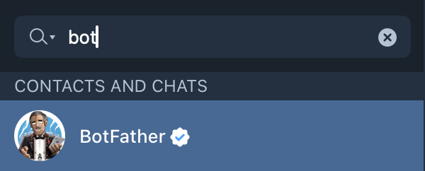
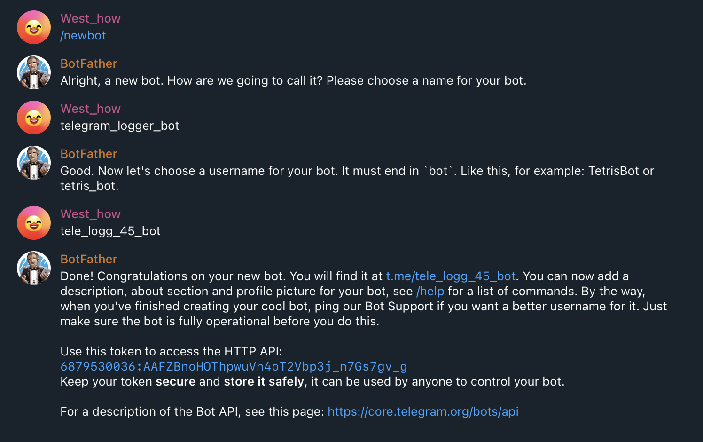
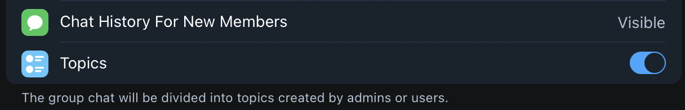
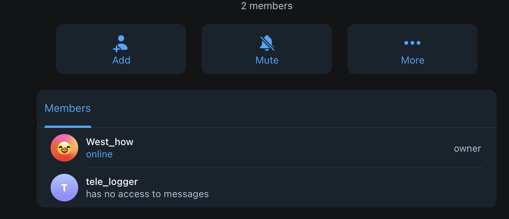
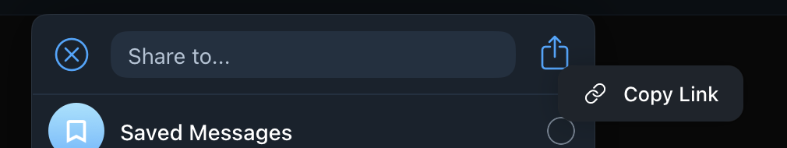
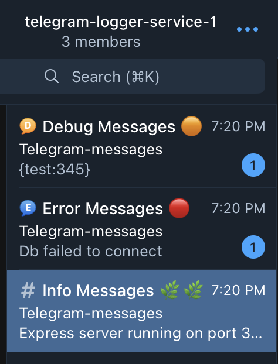

<h1 align="center">Telegram Error Logger</h1>

<div align="center">

Monitor server errors in real-time via Telegram. [Telegram Bot API](https://core.telegram.org/bots/api).


[](https://www.npmjs.com/package/telegram-error-logger)

## What does this package do
Send error or custom logs to telegram. Seperate your logs via telegram topic channels.

</div>

## 📦 Install

```sh
npm i telegram-error-logger
```
<br/>

[prerequisites setup 🔴](#prerequisites)

```js
//First create new file called initialise.ts this will create a single instance of your logger

import {Logger, Settings, TelegramChannels} from 'telegram-error-logger';
// Use your bot token that you created from bot father take a look at #prerequisites
const botToken = 'xxx'

const telegramChannel: TelegramChannels<'info' | 'error'> = {
  error: 'https://t.me/c/2021285143/1',
  info: 'https://t.me/c/2021285143/6',
};
const setting: Settings = {
  displayConsoleLogs: true,
  displayTelegramLogs: false,
  useColoredLogs: true,
  displayTime: true,
};

const logger = new Logger<'info' | 'error'>(botToken, telegramChannel, setting);

export {logger} // will be initialized with the correct type

```

```js
//example of when to use the logger 
import {logger} from './initialise.ts'
try{
  await dynamoDB.putItem(params)
}catch(error){
  logger.logMessage('error', `FAILURE: ${error.message}`)
}
```

<a name="prerequisites"></a>

## Prerequisites 
<b> Inorder to send messages (IMPORTANT!) </b>

1. Create a telegram account
2. Search for the bot father


3. Create a new telegram bot by writing the command ```/newbot``` in the chat and follow the steps. Copy the token id that was created. 
<b>(Dont copy mine it wont exist when you read this😇)</b>
<b> example bot token:</b>
 ```6879530036:AAFZBnoHOThpwuVn4oT2Vbp3j_n7Gs7gv_g```


4. Create a new private telegram chat group with topics turned on.


5. Add your telegram bot to the private group chat you have made and give it admin rights. 



8. Click the share button for the topic that you need (in this case info), then click the share button and copy the link.



## 🤖 Overview
This is a view of my setup


## How to contribute 

1. Clone the repository to your local machine.
2. Create a new branch on your local repository.
3. Follow the naming convention outlined in the article you provided (Check out this article) when naming your new branch.
5. Make the necessary changes to the code and push upstream, then open up a pr 


## DOCUMENTATION SOON: